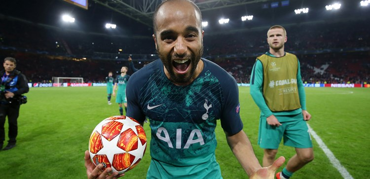
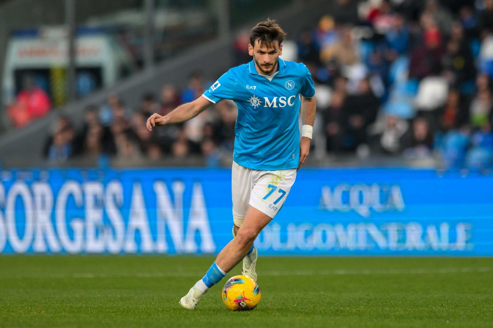
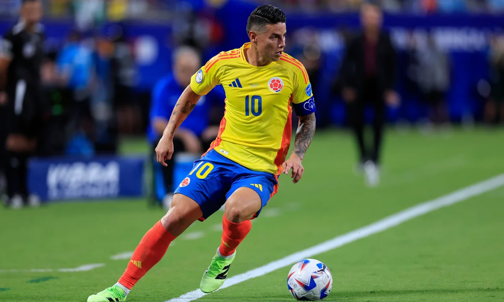

## personal top 10 favourite ⚽️ players of all time
###### (tottenham fan since 2016)

### 10. lucas moura 🇧🇷
#### "champions league fairy tale"

#### that hatrick in the champions league semi final against ajax alone puts lucas in my top 10. i remember being in sixth grade, staring at the live scoreboard on my old pc when it happened, absolute cinema.
 

### 9. khvicha kvaratskhelia 🇬🇪
#### "modern era magician"

#### kvara's explosive play style is so rare in this modern era, reminiscent of the flair players that dazzled with their dribbling when i was young. neymar, ribery, coutinho, ben arfa, eden hazard, maybe even a slight hint of messi and ronaldo.
 

### 8. christian eriksen 🇩🇰
#### "the great dane"

#### eriksen in his prime was the best playmaker i have ever witnessed on a football pitch. his vision, set piece ability, and occasional goal brought a unique level of creativity to every game he plays in.
 

### 7. paulo dybala 🇦🇷
#### "la joya"

#### the celebration, the two arm stripes, iconic. dybala symbolizes the traditional number 10.
 

### 6. mousa dembélé 🇧🇪
#### "different beast"

#### 6 seasons at tottenham but only lost the ball 13 times, dembélé was special in his prime. nicknamed 'ballerina feet' by teammates, his elegant dribbling style combined with his monster physicl traits are truly irreplaceable.
 

### 5. dele alli 🏴󠁧󠁢󠁥󠁮󠁧󠁿
#### "starboy"

#### the bellingham before bellingham, many forget dele. he was the original 'starboy' that screams prime tottenham. he was special in the pochettino era although his personal struggles eventually got in the way.
 

### 4. james rodríguez 🇨🇴
#### "2014 world cup golden boy"

#### pronounced "hamez", that 2014 world cup spectacle made us all believe that he was going to rise to the top of the world. everyone in elementary called me "hamez" for a time back then. 
 

### 3. kaoru mitoma 🇯🇵  
#### "the man who wrote a university thesis in dribbling"

#### already the highest scoring japanese scorer in premier league history, his unique blend of dribbling and wing play combined with his stereotypical asian background puts mitoma in my top 3.
 

### 2. eden hazard 🇧🇪 
#### "magician"

#### whenever he stepped onto the pitch it was beauty to the eye. it got to a point where i forgot/didn't even care anymore that he played for tottenham's second biggest rival in chelsea.
#### "eden hazard was playing mario kart in the dressing room and the fitness coach said '10 minutes and we're going out to warm up'. he hadn't changed but everybody else was ready to go. five minutes later he was still playing and the coach said 'eden come on man!' he said: don't worry, just give me the ball and there won't be a problem." - felipe luis, former teammate
 

### 1. son heung-min 🇰🇷 
#### "sonaldo"

#### completing the top 10, son. no explanation needed. 
#### "son shouting  do you know who i am after scoring against man city in the ucl quarter final after pep had called spurs the 'harry kane team' all week is one of the coldest moments in football history". - fans
