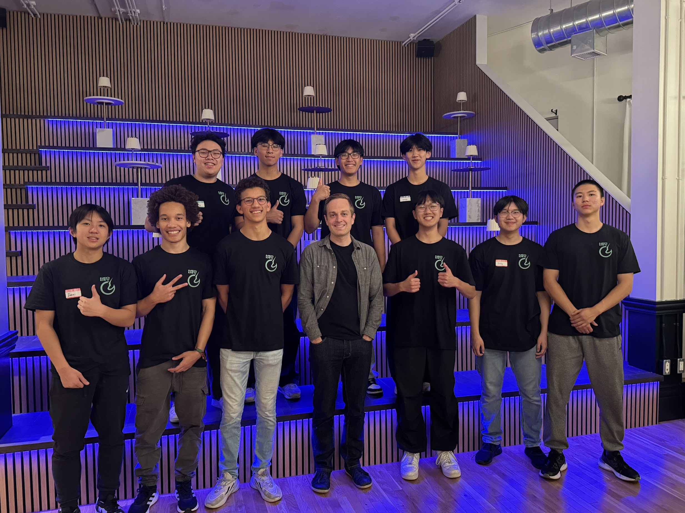

## founding neodev

#### neodev was founded in may 2024 following some fellow buddies and i identified some glaring issues in a typical hackathon experience.
##### 1. they lacked enthusiasm and energy.
##### 2. the small team sizes didn't reflect industry standards.
##### 3. beginners didn't feel sufficiently welcomed.

#### we then founded the neo developer league. our small team held weekly meetings in a concealed room in a uw science building for months. we planned an event experience like no other and pitched it to the world, gaining support from the wrdsb, convictional ai, and den 1880 in the heart of uptown waterloo.

 

<h3 style="text-decoration: underline;">neodev wrdsb summit</h3>

<h4> October 26, 2024, I ran the Neo Developer League, welcoming 100+ developers from more than 10 schools with <strong style="font-weight: bold;">$11k+</strong> in funding. The event was a success and built a strong foundation for more exciting events to come. </h4>

  

<a href="https://rogerkirkness.com/">roger</a> the 🐐 the event would not have ran without him

### 6ix summit upcoming...